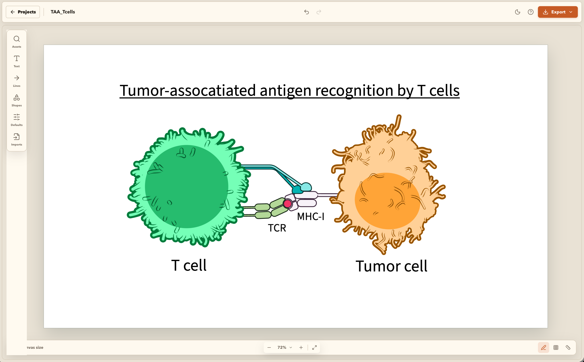
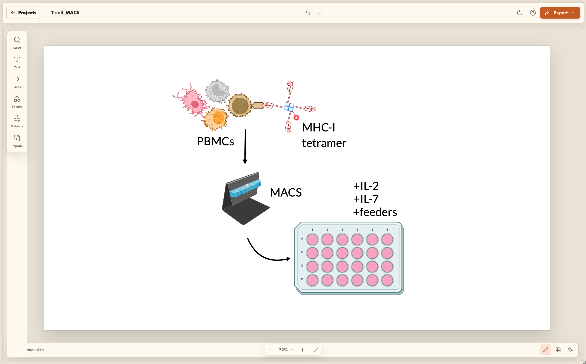

  

<h1 align="center">OpenSketch</h1>

  A private, browser-native editor for scientific figures.

  <a href="https://pkheisig.github.io/OpenSketch/"><strong>Launch OpenSketch&nbsp;&rarr;</strong></a>

<table>
  <tr>
    <td width="50%"></td>
    <td width="50%"></td>
  </tr>
</table>

OpenSketch combines an editable scientific illustration library with the text,
shape, connector, alignment, grouping, and export tools needed to assemble
publication-ready figures. It runs as a static web application: no account,
installation, or application server is required.

## What you can do

- Search and reuse thousands of bundled biological and laboratory illustrations.
- Add text, shapes, arrows, inhibitors, connectors, and imported media.
- Arrange, group, style, rotate, align, and layer objects on a freeform canvas.
- Organize local projects in folders, save reusable templates, and reopen them offline.
- Export editable SVG and PDF, high-resolution PNG, or portable `.OpenSketch`
  project files.

## Private by design

Projects, settings, and imported media stay in your browser. OpenSketch has no
account system, analytics, telemetry, or project-upload service. Export important
work as an `.OpenSketch` file for backup, especially before clearing browser data.
After the first visit, the installable web app can reopen its editor shell offline.
Use the Assets panel's **Prepare offline library** action when the complete bundled
illustration library is needed offline; this is an explicit, large download rather
than an automatic first-visit download.

## Open artwork and software

The bundled library includes public-domain and openly licensed artwork from
NIAID NIH BioArt, SciDraw, the Arcadia Science Free organism illustration
library, BioIcons, and Servier Medical Art. Every asset retains its original
source, author, and license metadata; exports preserve that provenance. If a
downstream figure tool strips embedded metadata, use the Export dialog's
readable credits download as a sidecar.

OpenSketch itself is licensed under
[AGPL-3.0-or-later](LICENSE). Artwork keeps its original license and is not
relicensed as part of the software.

## Project links

- [Contributor guide](CONTRIBUTING.md)
- [Architecture](docs/architecture.md)
- [Asset and licensing pipeline](docs/asset-pipeline.md)
- [Security policy](SECURITY.md)
- [Citation metadata](CITATION.cff)

OpenSketch is authored and maintained by Paul Heisig
([ORCID 0000-0002-8529-7944](https://orcid.org/0000-0002-8529-7944)).
