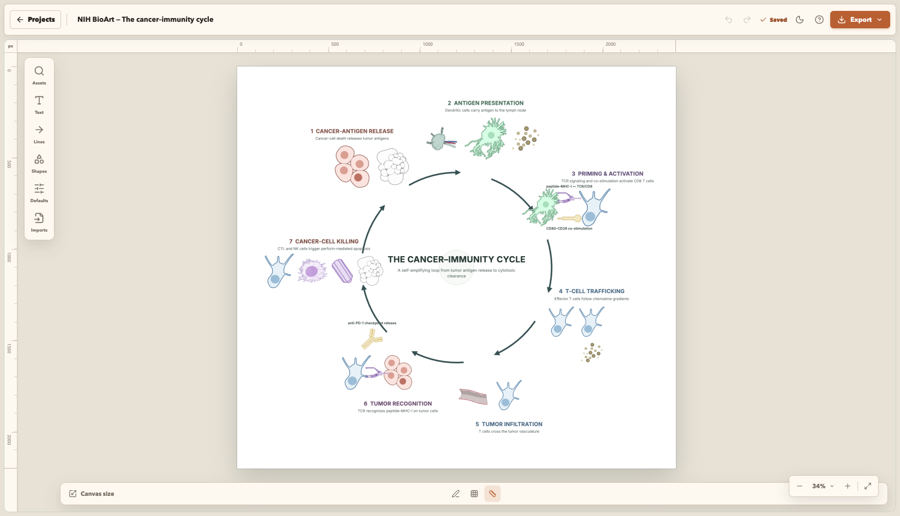
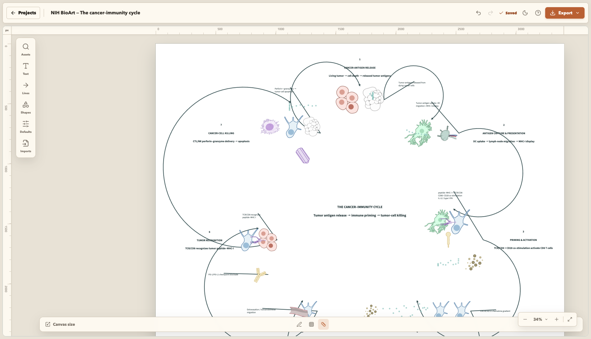
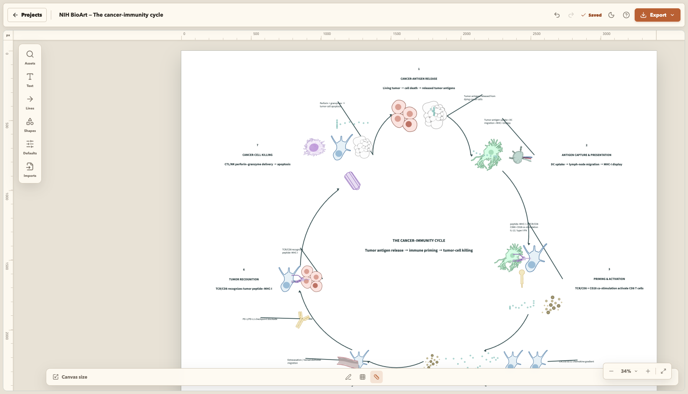
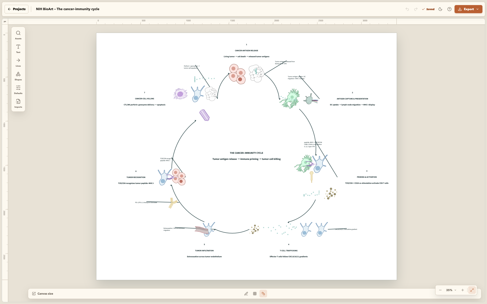

# PAU-478 / WEB-22 — Cancer-immunity cycle WebMCP experiment

This directory records the OpenSketch experiment used to rebuild the cancer-immunity-cycle figure from NIH BioArt assets. The saved project is `535ffc8c-1e17-426f-ad1f-215edad8b0f5`.

## Result

The final canvas contains one protected central hub, seven clockwise stage groups, seven persistently bound cycle connectors, outward stage labels, eight target-bound annotations, five particle fields, and 39 semantic biological relations.

The seven stages are:

1. Cancer-antigen release — living tumor, tumor-cell death, and released antigens.
2. Antigen capture and presentation — dendritic-cell uptake, lymph-node migration, and MHC-I display.
3. Priming and activation — dendritic-cell/CD8 contact, peptide-MHC-I/TCR-CD8 binding, CD80/CD28 co-stimulation, IL-12, and type-I IFN.
4. T-cell trafficking — effector T cells following CXCL9/10/11 gradients.
5. Tumor infiltration — extravasation across tumor endothelium.
6. Tumor recognition — TCR/CD8 recognition of tumor peptide-MHC-I plus external PD-1/PD-L1 checkpoint blockade.
7. Cancer-cell killing — CTL/NK delivery of perforin and granzymes followed by apoptosis.

## Composition method

- Existing canvas objects and semantic relations were inspected before mutation.
- Each stage was composed with `compose_labeled_group`.
- Biological contact, binding, secretion, migration, endothelial crossing, and progression were encoded with `compose_interaction`.
- Antigens, cytokines, chemokines, and perforin/granzymes use `create_particle_field`.
- Mechanistic labels use `create_annotation`; constrained labels use `fit_text`.
- `plan_layout` and `apply_layout_plan` place all seven stage groups around the protected hub.
- `connect_sequence` creates the complete clockwise cycle and binds every connector to a stage-content group.
- `repair_connectors` sends cycle connectors behind the biological assets.
- `analyze_composition` and `validate_figure` were repeated after repairs and after a full page reload.

The ordered command record and exact final object IDs are in [webmcp-command-log.md](webmcp-command-log.md). Machine-readable results are in [validation.json](validation.json).

## Renderer qualification fix

Visual inspection exposed a renderer bug: circular connectors always emitted the SVG large-arc flag, so a seven-stage cycle produced loops larger than 180 degrees. The experimental branch changes circular geometry to derive radius and large-arc selection from requested curvature. `connect_sequence` now supplies a `2 / stageCount` sweep for `cycle-arc` and chooses facing cardinal ports for each adjacent content group. Other sequence route types retain their existing behavior.

## Verification

```sh
pnpm exec vitest run tests/connectors.test.ts tests/semantic-editor-adapter.test.ts
pnpm --filter @workspace/web typecheck
pnpm --filter @workspace/web build
```

Results: 65/65 focused tests passed; TypeScript and the production Vite build passed. Cycle, scientific-diagram, and publication validation each returned zero errors, zero warnings, zero informational findings, no skipped checks, and no truncation after reload.

## Visual record

### 1. Starting composition

[](images/01-before.png)

### 2. Renderer large-arc failure discovered by visual QA

[](images/02-large-arc-failure.png)

### 3. Persistently bound minor arcs with facing ports

[](images/03-bound-minor-arcs.png)

### 4. Final live canvas after reload and validation

[](images/04-final-live.png)

Remote visual-QA report: <https://pub-2522e09cc0ae4b1ba2ff37cbba779674.r2.dev/OpenSketch/pau-478-cycle-route-geometry/20260903-100202-86666f5/index.html>

